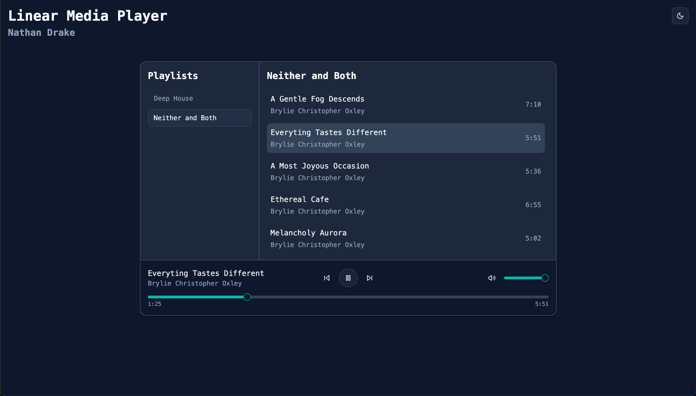
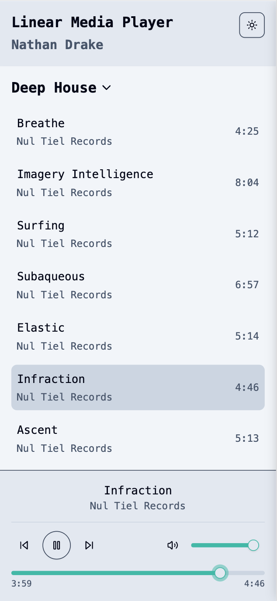

# Linear Media Player

<https://linear-media-player-nathan-drake.netlify.app/>



## Walkthrough

First of all, thank you for the take home. I always prefer to be judged on my work. It was a fun project!

The deployed site is at the top of the README. If you want to run it locally, be aware that I used Bun. If you don't have it installed, just use your package manager of choice and create a new lockfile.

### Highlights

#### Audio Player

I initially had the audio player in a hook that was used by the parent card component (MediaPlayer). This worked, but because I was prop drilling to the child components, then entire tree re-rendered every time the playback slider moved, which was multiple times per second. I then tried setting it in Context, but it had the same issue because the Context provider still re-rendered the whole tree.

I finally settled on using Zustand (first time for me). I set all of my state inside of the store so that each child component was only subscribed to the state it needed. Lastly, I broke out the playback slider and volume slider into their own components so that only they re-render when the sliders moved.

> NOTE: If you want to see how it's rendering, uncomment the React Scan script tag in index.html and spin up the dev server.

#### Accessibility

I recently went to a conference (Epic Web Conf) where one of the speakers demoed an a11y concept called a "roving tab index". This was the perfect chance to test it out.

For the track list, v0 initially set the items as clickable divs. This was not focusable at all. Buttons worked better, but that meant that a keyboard user would need to tab through the entire track list to get to the playblack controls.

With a roving tab index, the user can tab into the list, navigate with arrow keys, and then tab straight to the playblack controls.

#### Mobile / Light Mode



## TODO list

- [x] Update packages, switch to Bun
- [x] Add `js-style-kit` for eslint/prettier (my own package)
- [x] Compare tsconfig settings vs Matt Pocock's
- [x] Setup deployment (netlify)
- [x] Setup vitest with testing-library
- [x] Setup CI checks (eslint, prettier, typescript, tests)
- [x] Init shadcn & tailwind
- [x] Scaffold UI with v0
- [x] Connect UI to playlist data
- [x] Add tests (just axe/a11y test for now)
- [x] Optimize re-rendering on playback
- [x] Optimize UI for mobile
- [x] Final deploy
- [x] Write some documentation

## Original Instructions

Hey, thanks for taking the time to work on this exercise. We're excited to see what you come up with –
the goal is to create an audio player for playing a predefined playlist of audio files. Think of it
like a stripped-down version of Spotify or the classic Winamp.

### Getting started

Clone this repo which was created _just for you_, make it yours and let us know once the project is complete by pushing
your commits and replying through email.

You can use `npm` to install the dependencies and run the basic React project. Feel free to add any additional libraries
or frameworks you need.

```bash
npm install
npm run dev
```

### Requirements

We'd like to see a working media player that can play through a playlist of audio files (included), display info on the
currently playing track and supporting basic functionality like play/pause, next track, etc. Beyond that, feel free to get
creative with the design and functionality.

Plan on spending 2-4 hours to complete this exercise.

Please update this README to include a screenshot of the completed exercise at the top.

### Playlist data

The playlist data is stored in `src/data/playlists.json`. It includes a list of audio files and some associated metadata,
you can import the json file directly with no need for network requests.

### Attribution

This project includes music from the following albums:

- **"Deep House"** by _Nul Tiel Records_ is licensed under [CC BY-NC-SA 4.0](https://creativecommons.org/licenses/by-nc-sa/4.0/).
- **"Neither and Both"** by _Brylie Christopher Oxley_ is licensed under [CC BY 4.0](https://creativecommons.org/licenses/by/4.0/).
